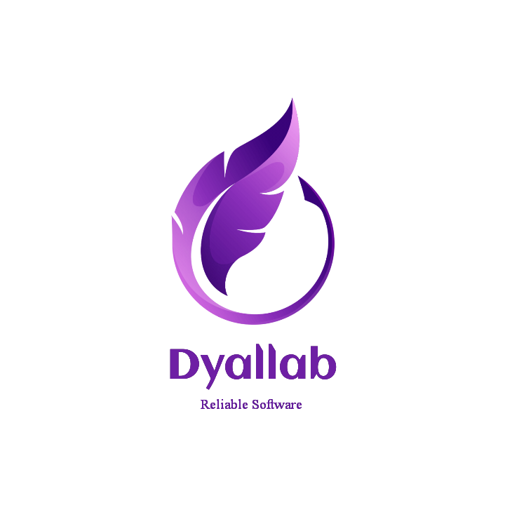

# 🪶 Dyallab Website



This is the repository for the [Dyallab](https://dyallab.software/) website.

## 🌐 Demo

See the [live demo](https://dyallab.software/).

## 🏃 Running the project locally

1. Clone the repo

```shell
git clone https://github.com/Dyallab/Website.git
```

2. Install dependencies

```shell
yarn install
```

3. Start the development server

```shell
yarn serve
```

4. Build the site

```shell
yarn build
```

## 📝 License

This project is licensed under the GNU License - see the [LICENSE](./LICENSE) file for details

## 🥳 Special thanks

Base template was created by [cruip](https://cruip.com/)
